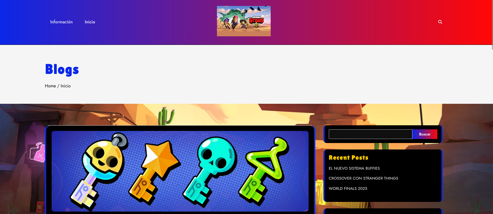
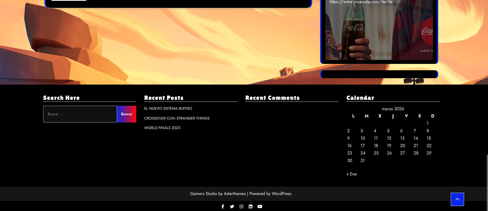

# practica_wordpress
Este proyecto consiste en la creación de un portal web utilizando WordPress. El sitio está dedicado al videojuego Brawl Stars y ofrece información sobre novedades, eventos y contenidos relacionados con el juego.

El portal incluye diferentes secciones del blog, como el nuevo sistema Buffies, el crossover con Stranger Things y las World Finals 2025. Además, cuenta con varias páginas informativas, un formulario de contacto, un mapa interactivo y soporte para varios idiomas.

El objetivo del proyecto es crear una web funcional, organizada y visualmente atractiva utilizando herramientas, plugins y personalización en WordPress.
Este proyecto consiste en la creación de un portal web utilizando WordPress. El sitio está dedicado al videojuego Brawl Stars y ofrece información sobre novedades, eventos y contenidos relacionados con el juego.

